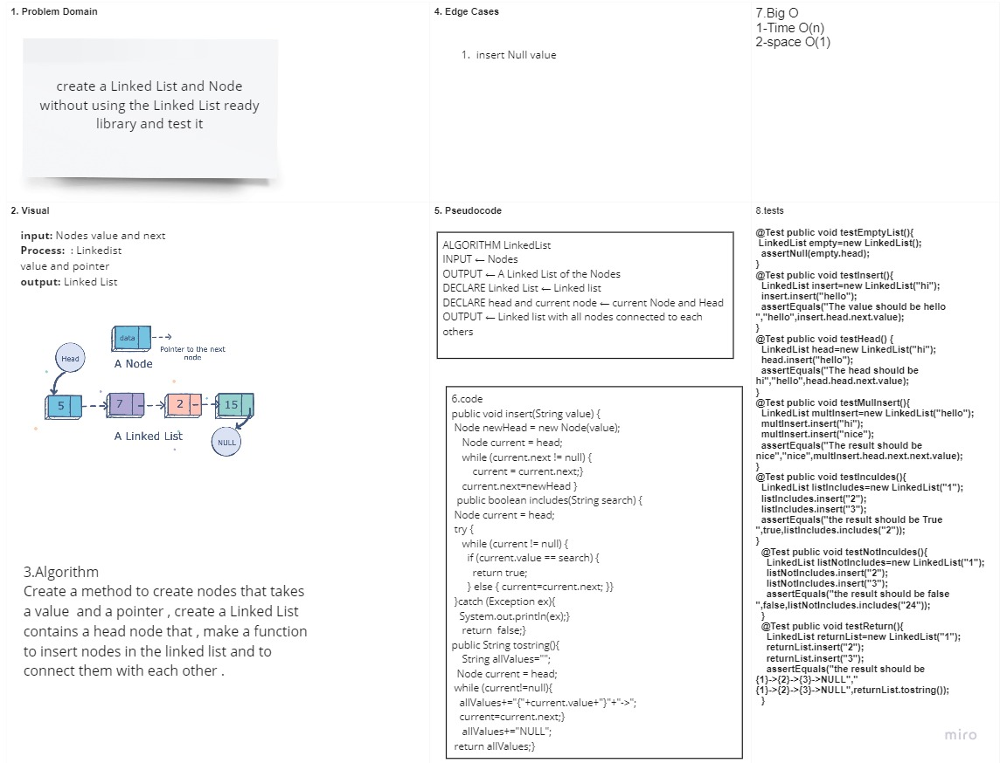

# Singly Linked List

## Linked List that connect nodes with each others contains of head and nodes

## Challenge

## create Linked list class with out using the linkedlist library (method )

## Approach & Efficiency

## created a node class and a linked list class to create nodes and connect them together in the linked list the big Os is O(n) for time and O(1) for space

## API

## create a insert method that allow to insert nodes in the Linked list

## create a contains method that checks if a specific element exists in the linked list

## create a toString method that print all the elements in the linkedlist

