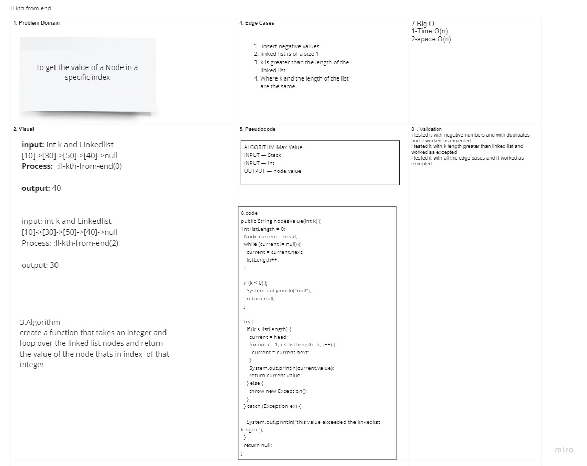

# ll-kth-from-end

## Challenge

## create a method that give the value of the node at index k (int)

## Approach & Efficiency

## created a method that takes a value (integer) and return the value of the node at that value .

## API

## create ll-kth-from-end method

