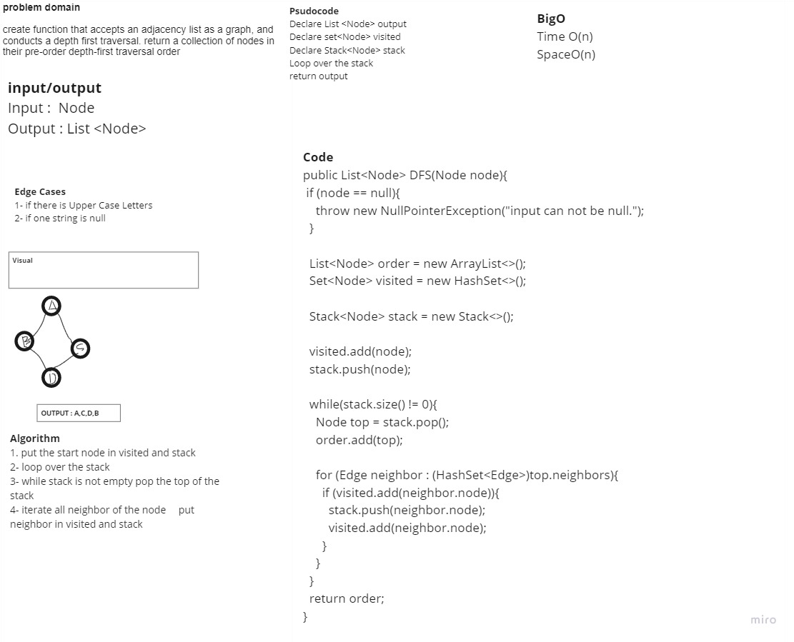

# Depth First

## Challenge Description

### create function that accepts an adjacency list as a graph, and conducts a depth first traversal. return a collection of nodes in their pre-order depth-first traversal order

## Approach & Efficiency

### Big O time is O(n), space is O(n)

## Solution

