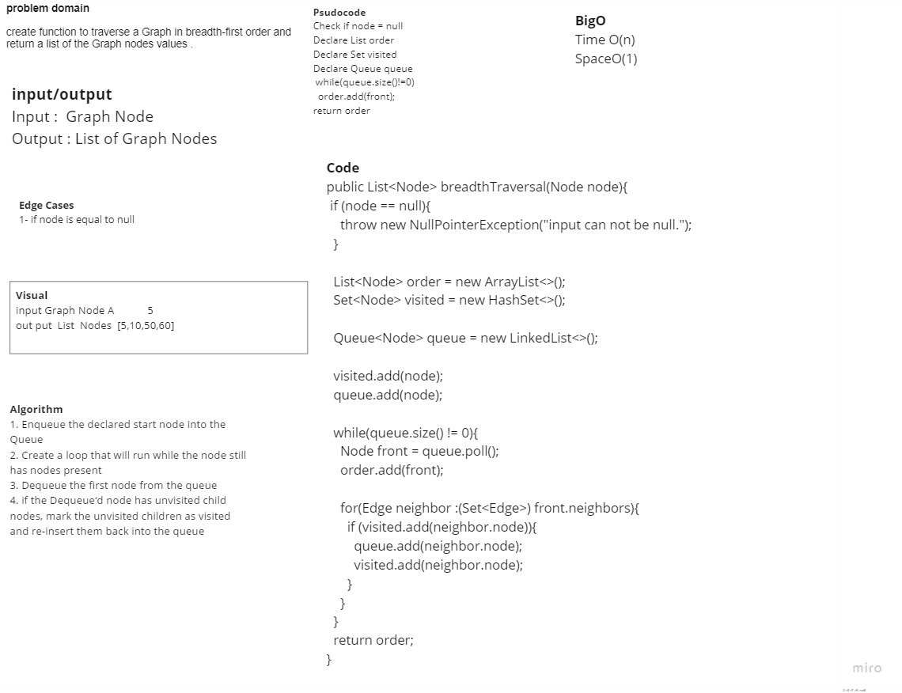

# breadth first

## Challenge Description

### create function to traverse a Graph in breadth-first order and return a list of the Graph nodes values .

## Approach & Efficiency

### Big O time is O(n), space is O(n).

## Solution

