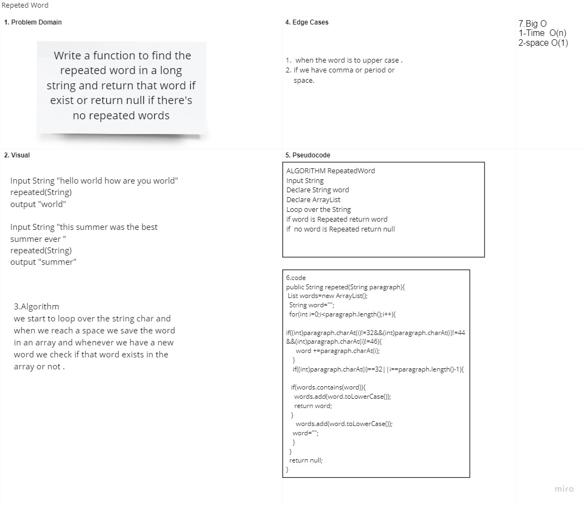

# Repeted Word

## Challenge Description

### Write a function to find the repeated word in a long string and return that word if exist or return null if there's no repeated words .

## Approach & Efficiency

### The approach for this was to use a for loop that begins at the 1st string char and used an arraylist to save the words in it and compare if the new word exist in the array or not .

## Solution

