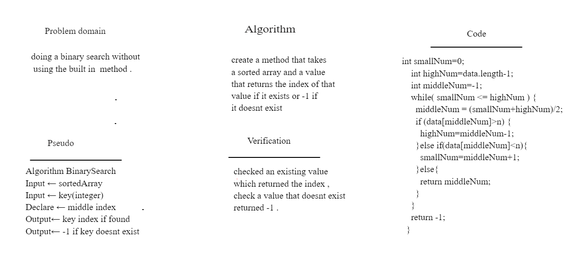

# Binary Search

# create function to do a binary search over a sorted array instead of linear search

## Challenge Description

### binary search a sorted array without using the existed binary search method.

## Approach & Efficiency

### using an array and a while loop with conditional statements 

## Solution

