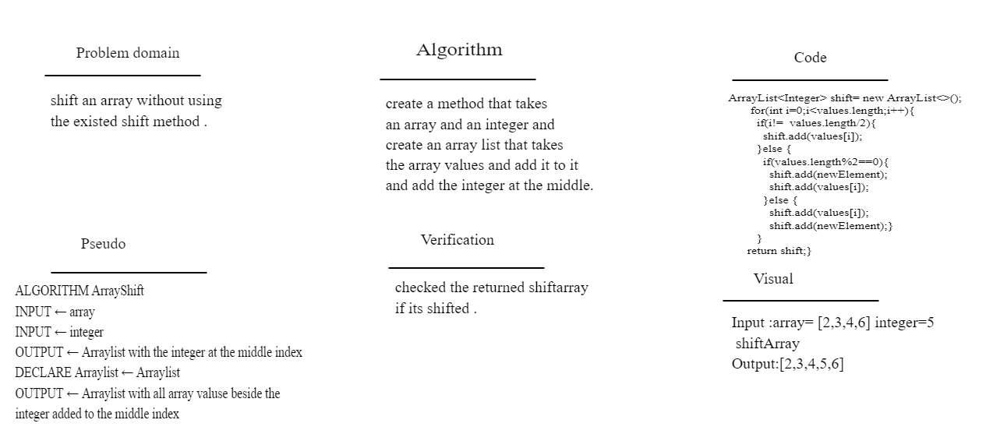

# Shift an Array

# create function that takes an array and a number and add it at the middle of the array

## Challenge Description

### shift an array without using the existed shift method.

## Approach & Efficiency

### using an arraylist and conditional statement and a for loop

## Solution

