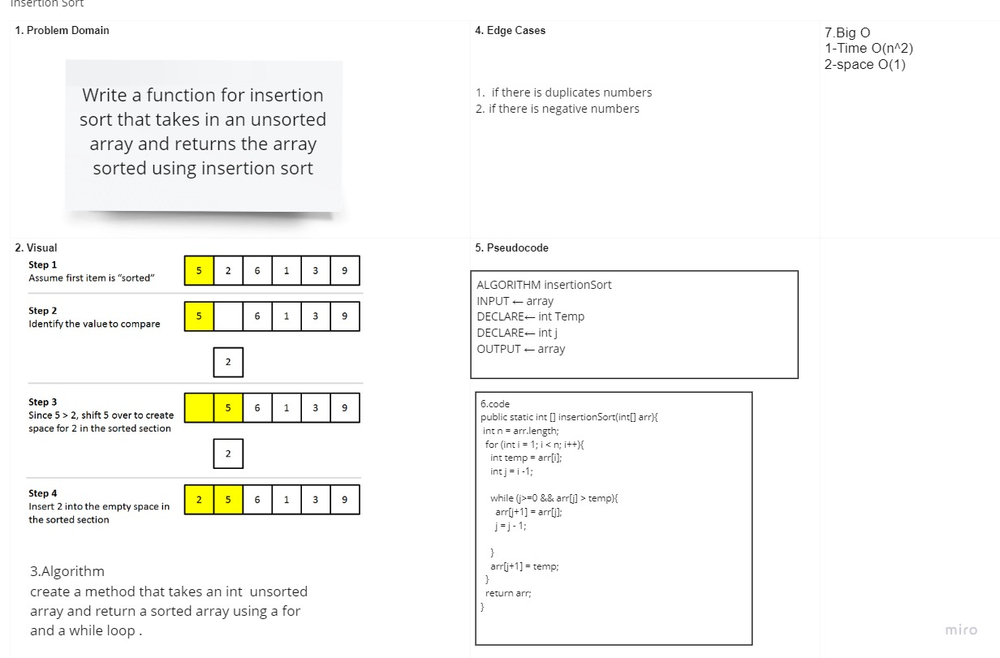

# Insertion Sort

## Challenge Description

### Write a function for insertion sort that takes in an unsorted array and returns the array sorted using insertion sort.

## Approach & Efficiency

### The approach for this was to use a for loop that begins at the 2nd value in the array, and compare it to every value before it, while the next value is still greater than the current one being moved. Every time a value before the one being moved is greater than the one being moved, that larger value is shifted forward one index.

## Solution

