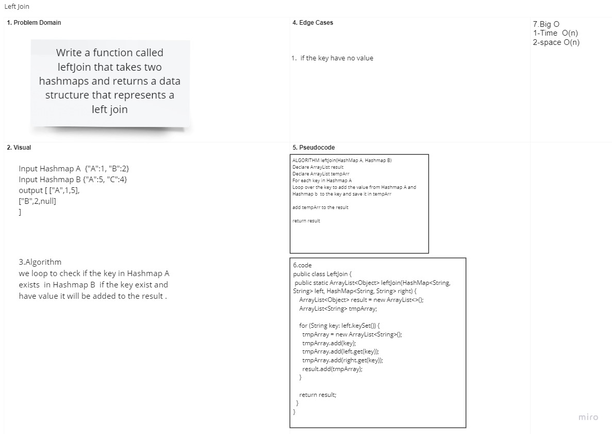

# LeftJoin

## Challenge Description

### create function that takes two Hashmaps and left join the two hashmaps into a single data structure

## Approach & Efficiency

### using a for loop and declaring an arraylist to compare add the value having the same key from hashmpa b to hashmap a and return a single arraylist

## Solution

