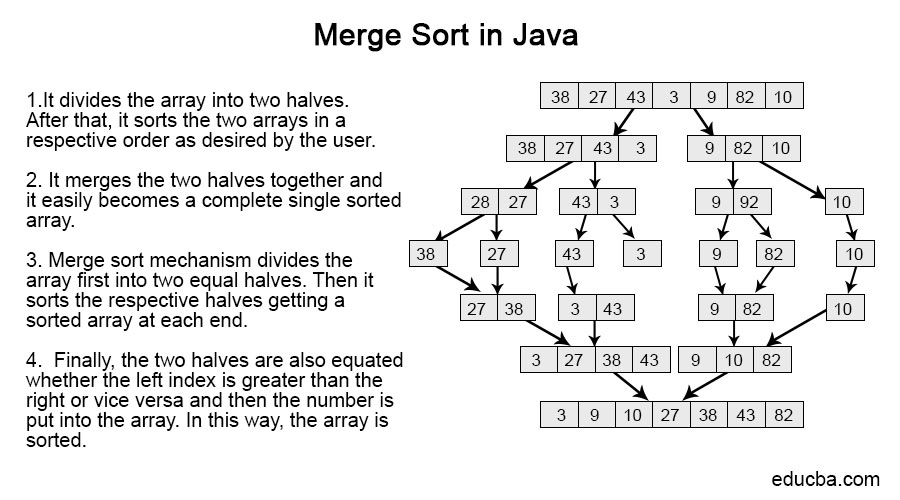

# Merge Sort

## Merge Sort is a Divide and Conquer algorithm. It divides input array in two halves, calls itself for the two halves and then merges the two sorted halves.

## Pesudo Code

ALGORITHM Mergesort(arr)
DECLARE n <-- arr.length

    if arr.length > 1
      DECLARE mid <-- n/2
      DECLARE b <-- arr[0...mid]
      DECLARE c <-- arr[mid...n]
      // break down the left side
      Mergesort(b)
      // break down the right side
      Mergesort(c)
      // merge the left and the right side together
      Merge(b, c, arr)

ALGORITHM Merge(b, c, a)
DECLARE i <-- 0
DECLARE j <-- 0
DECLARE k <-- 0

    while i < b && j < c
        if b[i] <= c[j]
            a[k] <-- b[i]
            i <-- i + 1
        else
            a[k] = c[j]
            j <-- j + 1

        k <-- k + 1

    if i = b.length
       add remaining items in array c to array a
    else
       add remaining items in array b to array a

    return a

## Algorithm

### 1. Find the middle point to divide the array into two halves:

### 2. Call mergeSort for first half:

### 3. Call mergeSort for second half:

### 4. Merge the two halves sorted in step 2 and 3

## Time complexity : O(N\*log(N))

## Space complexity: O(N).
