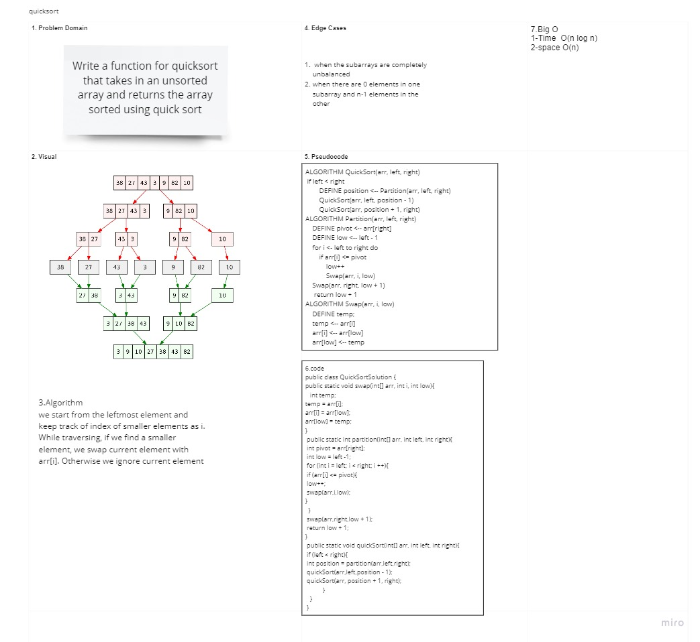

# Quick Sort

## Quicksort is a divide-and-conquer algorithm. It works by selecting a 'pivot' element from the array and partitioning the other elements into two sub-arrays, according to whether they are less than or greater than the pivot.

## Pesudo Code

ALGORITHM QuickSort(arr, left, right)
if left < right
DEFINE position <-- Partition(arr, left, right)
QuickSort(arr, left, position - 1)
QuickSort(arr, position + 1, right)
ALGORITHM Partition(arr, left, right)
DEFINE pivot <-- arr[right]
DEFINE low <-- left - 1
for i <- left to right do
if arr[i] <= pivot
low++
Swap(arr, i, low)
Swap(arr, right, low + 1)
return low + 1

ALGORITHM Swap(arr, i, low)
DEFINE temp;
temp <-- arr[i]
arr[i] <-- arr[low]
arr[low] <-- temp

## Algorithm

## Using pivot algorithm recursively, we end up with smaller possible partitions. Each partition is then processed for quick sort.

## Time complexity as O(n\*log n).

## Space Complexity: O(n\*log n)

## White board

