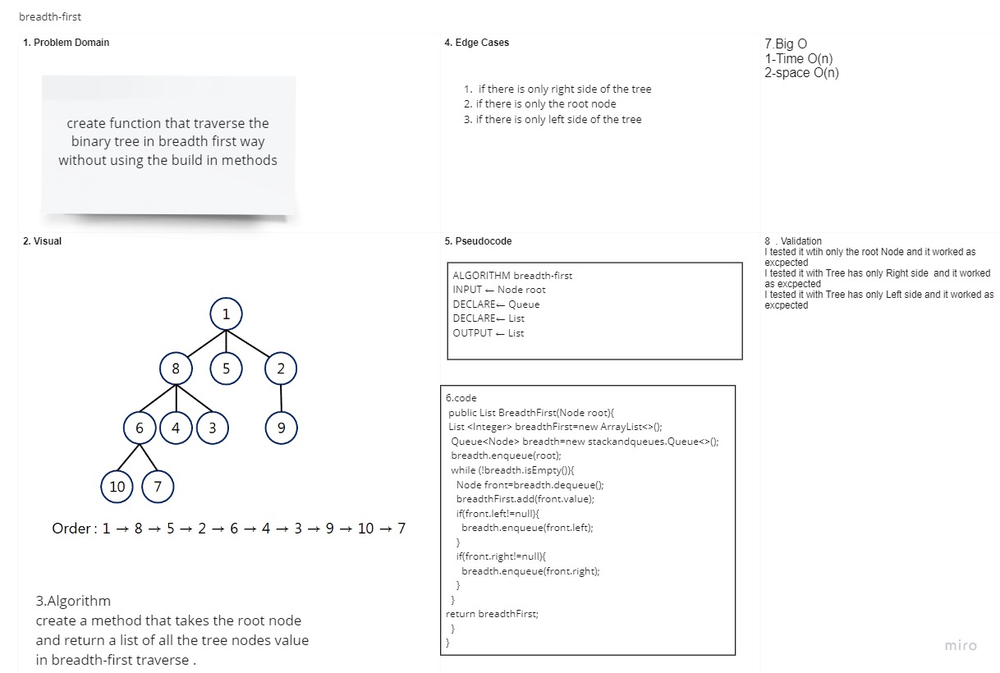

# breadth-first

## Challenge Description

### create function to traverse a tree in breadth-first order and return a list of the tree nodes value .

## Approach & Efficiency

### using the root node and a while loop to loop all over the tree and traverse it in breadth-first traverse .

## Solution

