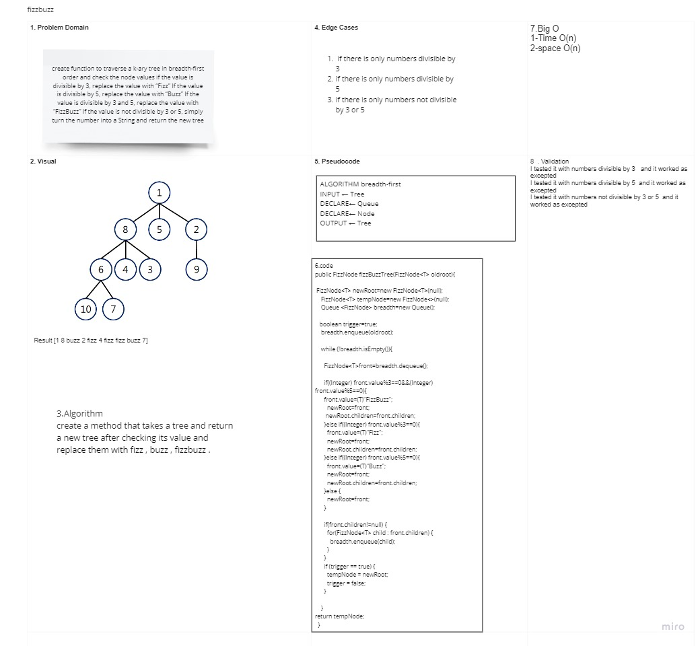

# fizzbuzz

## Challenge Description

### create function to traverse a k-ary tree in breadth-first order and check the node values if the value is divisible by 3, replace the value with “Fizz” If the value is divisible by 5, replace the value with “Buzz” If the value is divisible by 3 and 5, replace the value with “FizzBuzz” If the value is not divisible by 3 or 5, simply turn the number into a String and return the new tree .

## Approach & Efficiency

### using a FizzBuzz node and a while loop to traverse the tree and check the values .

## Solution

