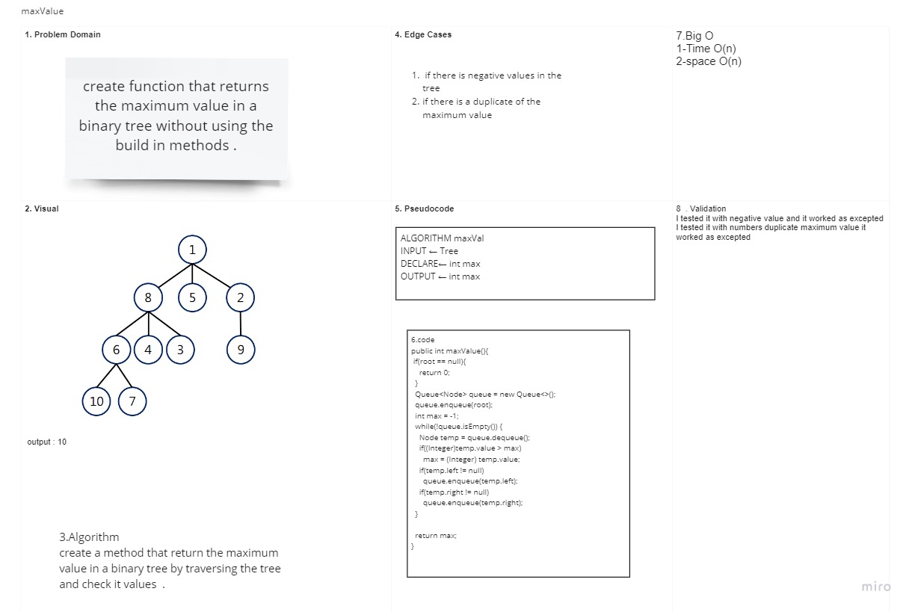

# maxValue

## Challenge Description

### create function that returns the maximum value in a binary tree without using the build in methods by traversing the tree and checking its values .

## Approach & Efficiency

### using a while loop and declaring an int to compare it with each node value and change the integer value depending on the maximum value in the nodes .

## Solution

